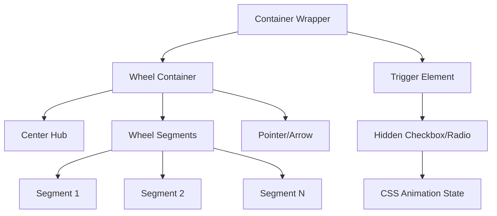
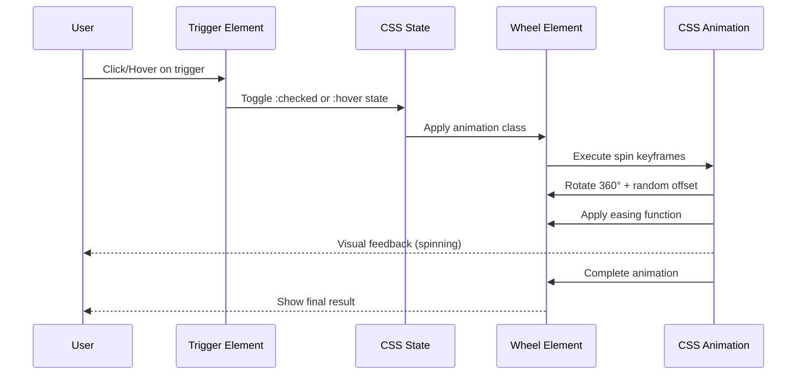
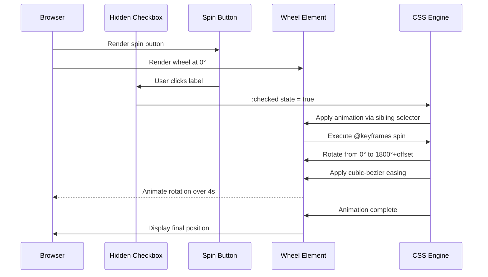

# Design Document: Spinning Decision Wheel

## Overview

The Spinning Decision Wheel is a visually stunning, interactive component built exclusively with HTML and Tailwind CSS. This feature creates an impressive spinning wheel animation without any JavaScript, leveraging pure CSS animations, transforms, and Tailwind's utility classes. The wheel will feature smooth rotation animations, beautiful gradients, shadows, and visual effects that create a "wow" factor for viewers. The design uses CSS checkbox hack or hover states to trigger animations, making it interactive while maintaining the no-JS constraint.

## Architecture

The component architecture consists of nested HTML elements styled with Tailwind CSS classes, utilizing CSS animations and transforms for the spinning effect.



## Sequence Diagrams

### User Interaction Flow



## Components and Interfaces

### Component 1: Wheel Container

**Purpose**: Main container that holds all wheel elements and manages layout

**Structure**:
```pascal
STRUCTURE WheelContainer
  element: div
  classes: [
    "relative",
    "w-96", "h-96",
    "mx-auto",
    "perspective-1000"
  ]
  children: [CenterHub, WheelSegments, Pointer]
END STRUCTURE
```

**Responsibilities**:
- Provide positioning context for absolute elements
- Define wheel dimensions
- Center the wheel in viewport
- Establish 3D perspective for depth effects

### Component 2: Wheel Segments

**Purpose**: Individual slices of the wheel containing options

**Structure**:
```pascal
STRUCTURE WheelSegment
  element: div
  classes: [
    "absolute",
    "w-full", "h-full",
    "origin-center",
    "clip-path-polygon",
    "transition-all"
  ]
  attributes:
    rotation: angle (calculated per segment)
    color: gradient or solid color
    content: text label
END STRUCTURE
```

**Responsibilities**:
- Display individual decision options
- Apply unique rotation for positioning
- Render with distinct colors/gradients
- Contain text labels for options

### Component 3: Center Hub

**Purpose**: Central decorative element and visual anchor

**Structure**:
```pascal
STRUCTURE CenterHub
  element: div
  classes: [
    "absolute",
    "w-24", "h-24",
    "rounded-full",
    "bg-gradient-to-br",
    "shadow-2xl",
    "z-10",
    "flex", "items-center", "justify-center"
  ]
  content: "SPIN" text or icon
END STRUCTURE
```

**Responsibilities**:
- Provide visual center point
- Display call-to-action text
- Add depth with shadows
- Cover segment intersections

### Component 4: Pointer/Arrow

**Purpose**: Indicator showing the selected result

**Structure**:
```pascal
STRUCTURE Pointer
  element: div
  classes: [
    "absolute",
    "w-0", "h-0",
    "border-solid",
    "border-l-transparent",
    "border-r-transparent",
    "z-20"
  ]
  position: top center
END STRUCTURE
```

**Responsibilities**:
- Indicate winning segment
- Remain stationary while wheel spins
- Provide clear visual reference point

### Component 5: Trigger Mechanism

**Purpose**: Enable animation without JavaScript

**Structure**:
```pascal
STRUCTURE TriggerMechanism
  element: input[type="checkbox"] or input[type="radio"]
  classes: ["hidden"]
  sibling: label element
  
  label_classes: [
    "cursor-pointer",
    "px-8", "py-4",
    "bg-gradient-to-r",
    "rounded-full",
    "shadow-lg",
    "hover:shadow-2xl",
    "transition-all"
  ]
END STRUCTURE
```

**Responsibilities**:
- Capture user interaction
- Toggle CSS state via :checked pseudo-class
- Trigger wheel animation
- Provide visual feedback

## Data Models

### Model 1: Wheel Configuration

```pascal
STRUCTURE WheelConfig
  segments: Array of Segment
  colors: Array of Color
  duration: String (CSS time value)
  easing: String (CSS easing function)
  rotations: Number (full spins before stopping)
END STRUCTURE
```

**Validation Rules**:
- segments.length must be between 2 and 12
- colors.length must equal segments.length
- duration must be valid CSS time (e.g., "3s", "5000ms")
- rotations must be positive integer

### Model 2: Segment

```pascal
STRUCTURE Segment
  id: String
  label: String
  rotation: Number (degrees)
  colorStart: String (hex or Tailwind color)
  colorEnd: String (hex or Tailwind color)
  clipPath: String (polygon coordinates)
END STRUCTURE
```

**Validation Rules**:
- label must be non-empty string
- rotation must be between 0 and 360
- colors must be valid CSS color values

### Model 3: Animation State

```pascal
STRUCTURE AnimationState
  isSpinning: Boolean (derived from :checked state)
  currentRotation: Number (degrees)
  finalRotation: Number (degrees)
  animationName: String (keyframe name)
END STRUCTURE
```

## Main Algorithm/Workflow



## Algorithmic Pseudocode

### Main Spin Animation Algorithm

```pascal
ALGORITHM initializeWheelAnimation
INPUT: wheelElement, segmentCount, animationDuration
OUTPUT: Configured CSS animation

BEGIN
  // Calculate segment angles
  segmentAngle ← 360 / segmentCount
  
  // Generate segment rotations
  FOR i FROM 0 TO segmentCount - 1 DO
    rotation ← i * segmentAngle
    applyRotationToSegment(i, rotation)
  END FOR
  
  // Define keyframe animation
  DEFINE KEYFRAMES spin AS
    0%: transform = rotate(0deg)
    100%: transform = rotate(1800deg + randomOffset)
  END KEYFRAMES
  
  // Apply animation on :checked state
  WHEN checkbox:checked ~ wheelElement THEN
    animation ← "spin " + animationDuration + " cubic-bezier(0.17, 0.67, 0.12, 0.99) forwards"
    APPLY animation TO wheelElement
  END WHEN
  
  RETURN wheelElement
END
```

**Preconditions:**
- wheelElement exists in DOM
- segmentCount is positive integer between 2 and 12
- animationDuration is valid CSS time value

**Postconditions:**
- All segments positioned correctly around circle
- Animation keyframes defined
- Checkbox trigger connected to animation
- Wheel spins when checkbox checked

**Loop Invariants:**
- Each segment rotation is unique and evenly distributed
- Total rotation coverage equals 360 degrees

### Segment Positioning Algorithm

```pascal
ALGORITHM positionSegments
INPUT: segments (array), containerRadius
OUTPUT: Positioned segment elements

BEGIN
  segmentCount ← LENGTH(segments)
  anglePerSegment ← 360 / segmentCount
  
  FOR each segment IN segments WITH index i DO
    ASSERT i >= 0 AND i < segmentCount
    
    // Calculate rotation angle
    rotationAngle ← i * anglePerSegment
    
    // Calculate clip-path for segment shape
    centerX ← 50
    centerY ← 50
    
    // Create triangular segment from center
    point1 ← (centerX, centerY)
    point2 ← calculatePointOnCircle(centerX, centerY, rotationAngle)
    point3 ← calculatePointOnCircle(centerX, centerY, rotationAngle + anglePerSegment)
    
    clipPath ← "polygon(" + point1 + ", " + point2 + ", " + point3 + ")"
    
    // Apply styles
    segment.style.transform ← "rotate(" + rotationAngle + "deg)"
    segment.style.clipPath ← clipPath
    segment.style.background ← generateGradient(i)
    
    ASSERT segment.style.transform IS VALID
  END FOR
  
  RETURN segments
END

FUNCTION calculatePointOnCircle(centerX, centerY, angle)
  radius ← 50
  x ← centerX + radius * cos(angle * PI / 180)
  y ← centerY + radius * sin(angle * PI / 180)
  RETURN (x + "%", y + "%")
END FUNCTION

FUNCTION generateGradient(index)
  colors ← predefinedColorPalette
  colorIndex ← index MOD LENGTH(colors)
  RETURN "linear-gradient(135deg, " + colors[colorIndex].start + ", " + colors[colorIndex].end + ")"
END FUNCTION
```

**Preconditions:**
- segments array is non-empty
- containerRadius is positive number
- All segments are valid DOM elements

**Postconditions:**
- Each segment has unique rotation angle
- All segments together form complete circle
- Clip paths create proper triangular shapes
- Gradients applied to all segments

**Loop Invariants:**
- Sum of all segment angles equals 360 degrees
- Each segment's rotation is i * anglePerSegment
- All processed segments have valid transforms

## Key Functions with Formal Specifications

### Function 1: createWheelStructure()

```pascal
FUNCTION createWheelStructure(options: Array<String>): HTMLElement
```

**Preconditions:**
- options is non-empty array
- options.length >= 2 and options.length <= 12
- All options are non-empty strings

**Postconditions:**
- Returns valid HTMLElement containing complete wheel structure
- Wheel has exactly options.length segments
- All segments are properly positioned
- Center hub is rendered
- Pointer is positioned at top

**Loop Invariants:** N/A (no explicit loops in function signature)

### Function 2: generateSegmentStyles()

```pascal
FUNCTION generateSegmentStyles(segmentIndex: Number, totalSegments: Number): CSSProperties
```

**Preconditions:**
- segmentIndex >= 0
- segmentIndex < totalSegments
- totalSegments >= 2

**Postconditions:**
- Returns valid CSSProperties object
- Contains transform property with rotation
- Contains clip-path property for segment shape
- Contains background gradient
- Rotation angle = segmentIndex * (360 / totalSegments)

**Loop Invariants:** N/A

### Function 3: createSpinAnimation()

```pascal
FUNCTION createSpinAnimation(duration: String, finalAngle: Number): KeyframeAnimation
```

**Preconditions:**
- duration is valid CSS time value (e.g., "3s", "4000ms")
- finalAngle >= 360 (at least one full rotation)
- finalAngle <= 7200 (maximum 20 rotations for performance)

**Postconditions:**
- Returns valid @keyframes definition
- Animation starts at 0deg
- Animation ends at finalAngle
- Includes easing function for smooth deceleration
- Animation plays once (forwards fill mode)

**Loop Invariants:** N/A

## Example Usage

```html
<!-- Complete HTML Structure -->
<div class="min-h-screen bg-gradient-to-br from-purple-900 via-blue-900 to-indigo-900 flex items-center justify-center p-8">
  
  <!-- Hidden checkbox for state management -->
  <input type="checkbox" id="spin-trigger" class="hidden peer" />
  
  <!-- Main wheel container -->
  <div class="relative">
    
    <!-- Wheel wrapper with 3D perspective -->
    <div class="relative w-96 h-96 mx-auto perspective-1000">
      
      <!-- Pointer at top -->
      <div class="absolute top-0 left-1/2 -translate-x-1/2 -translate-y-2 z-20 w-0 h-0 border-l-[20px] border-l-transparent border-r-[20px] border-r-transparent border-t-[40px] border-t-yellow-400 drop-shadow-2xl"></div>
      
      <!-- Wheel disc - spins on checkbox checked -->
      <div class="absolute inset-0 rounded-full shadow-2xl peer-checked:animate-[spin_4s_cubic-bezier(0.17,0.67,0.12,0.99)_forwards] peer-checked:[animation-iteration-count:1] peer-checked:[transform:rotate(1800deg)]">
        
        <!-- Segment 1 -->
        <div class="absolute inset-0 origin-center" style="transform: rotate(0deg); clip-path: polygon(50% 50%, 50% 0%, 100% 0%, 93.3% 25%);">
          <div class="w-full h-full bg-gradient-to-br from-red-500 to-pink-600 flex items-start justify-center pt-8">
            <span class="text-white font-bold text-lg">Option 1</span>
          </div>
        </div>
        
        <!-- Segment 2 -->
        <div class="absolute inset-0 origin-center" style="transform: rotate(60deg); clip-path: polygon(50% 50%, 50% 0%, 100% 0%, 93.3% 25%);">
          <div class="w-full h-full bg-gradient-to-br from-orange-500 to-yellow-600 flex items-start justify-center pt-8">
            <span class="text-white font-bold text-lg -rotate-60">Option 2</span>
          </div>
        </div>
        
        <!-- Segment 3 -->
        <div class="absolute inset-0 origin-center" style="transform: rotate(120deg); clip-path: polygon(50% 50%, 50% 0%, 100% 0%, 93.3% 25%);">
          <div class="w-full h-full bg-gradient-to-br from-green-500 to-emerald-600 flex items-start justify-center pt-8">
            <span class="text-white font-bold text-lg -rotate-[120deg]">Option 3</span>
          </div>
        </div>
        
        <!-- Segment 4 -->
        <div class="absolute inset-0 origin-center" style="transform: rotate(180deg); clip-path: polygon(50% 50%, 50% 0%, 100% 0%, 93.3% 25%);">
          <div class="w-full h-full bg-gradient-to-br from-blue-500 to-cyan-600 flex items-start justify-center pt-8">
            <span class="text-white font-bold text-lg -rotate-180">Option 4</span>
          </div>
        </div>
        
        <!-- Segment 5 -->
        <div class="absolute inset-0 origin-center" style="transform: rotate(240deg); clip-path: polygon(50% 50%, 50% 0%, 100% 0%, 93.3% 25%);">
          <div class="w-full h-full bg-gradient-to-br from-indigo-500 to-purple-600 flex items-start justify-center pt-8">
            <span class="text-white font-bold text-lg -rotate-[240deg]">Option 5</span>
          </div>
        </div>
        
        <!-- Segment 6 -->
        <div class="absolute inset-0 origin-center" style="transform: rotate(300deg); clip-path: polygon(50% 50%, 50% 0%, 100% 0%, 93.3% 25%);">
          <div class="w-full h-full bg-gradient-to-br from-violet-500 to-fuchsia-600 flex items-start justify-center pt-8">
            <span class="text-white font-bold text-lg -rotate-[300deg]">Option 6</span>
          </div>
        </div>
        
        <!-- Center hub -->
        <div class="absolute top-1/2 left-1/2 -translate-x-1/2 -translate-y-1/2 w-24 h-24 rounded-full bg-gradient-to-br from-yellow-400 via-orange-500 to-red-500 shadow-2xl flex items-center justify-center z-10 border-4 border-white">
          <span class="text-white font-black text-xl">SPIN</span>
        </div>
      </div>
      
      <!-- Decorative outer ring -->
      <div class="absolute inset-0 rounded-full border-8 border-yellow-400 shadow-[0_0_30px_rgba(250,204,21,0.5)] pointer-events-none"></div>
    </div>
    
    <!-- Spin button (label for checkbox) -->
    <label for="spin-trigger" class="mt-12 block mx-auto w-fit cursor-pointer px-12 py-5 bg-gradient-to-r from-yellow-400 via-orange-500 to-red-500 text-white font-black text-2xl rounded-full shadow-2xl hover:shadow-[0_0_40px_rgba(251,146,60,0.8)] hover:scale-110 transition-all duration-300 active:scale-95">
      SPIN THE WHEEL
    </label>
    
    <!-- Reset button (another label to uncheck) -->
    <label for="spin-trigger" class="mt-4 block mx-auto w-fit cursor-pointer px-8 py-3 bg-gray-700 text-white font-bold text-lg rounded-full shadow-lg hover:bg-gray-600 transition-all duration-300">
      Reset
    </label>
  </div>
</div>
```

## Correctness Properties

### Property 1: Segment Coverage Completeness

```pascal
PROPERTY segmentCoverageComplete
  FORALL wheel IN WheelInstances:
    SUM(segment.angle FOR segment IN wheel.segments) = 360
```

**Verification**: Sum of all segment angles must equal exactly 360 degrees to form complete circle.

### Property 2: Animation State Consistency

```pascal
PROPERTY animationStateConsistent
  FORALL wheel IN WheelInstances:
    (checkbox.checked = true) IMPLIES (wheel.isAnimating = true)
    AND
    (checkbox.checked = false) IMPLIES (wheel.isAnimating = false)
```

**Verification**: Wheel animation state must always match checkbox checked state.

### Property 3: Segment Positioning Uniqueness

```pascal
PROPERTY segmentPositionsUnique
  FORALL wheel IN WheelInstances:
    FORALL i, j IN [0, wheel.segments.length):
      (i ≠ j) IMPLIES (wheel.segments[i].rotation ≠ wheel.segments[j].rotation)
```

**Verification**: No two segments can have identical rotation angles.

### Property 4: Visual Hierarchy Preservation

```pascal
PROPERTY visualHierarchyPreserved
  FORALL wheel IN WheelInstances:
    zIndex(pointer) > zIndex(centerHub) > zIndex(segments)
```

**Verification**: Z-index layering must maintain pointer on top, then center hub, then segments.

### Property 5: Animation Completion

```pascal
PROPERTY animationCompletes
  FORALL wheel IN WheelInstances:
    WHEN animation.starts THEN
      EVENTUALLY animation.ends
      AND wheel.rotation = animation.finalRotation
```

**Verification**: Every started animation must complete and reach its final rotation value.

## Error Handling

### Error Scenario 1: Invalid Segment Count

**Condition**: User attempts to create wheel with < 2 or > 12 segments
**Response**: Fallback to default 6 segments
**Recovery**: Display warning message (via CSS content property) and render with default configuration

### Error Scenario 2: Missing Tailwind CSS

**Condition**: Tailwind CSS not loaded or unavailable
**Response**: Inline critical styles as fallback
**Recovery**: Use standard CSS classes with similar visual effect

### Error Scenario 3: Browser Lacks CSS Animation Support

**Condition**: Browser doesn't support @keyframes or CSS animations
**Response**: Display static wheel without animation
**Recovery**: Show message indicating browser limitation

### Error Scenario 4: Checkbox State Persistence

**Condition**: Checkbox remains checked after animation completes
**Response**: Provide reset mechanism via second label
**Recovery**: User can click reset to uncheck and re-enable spinning

## Testing Strategy

### Unit Testing Approach

Since this is pure HTML/CSS, testing focuses on visual regression and CSS property validation:

1. **Segment Rendering Tests**
   - Verify correct number of segments rendered
   - Validate rotation angles are evenly distributed
   - Check clip-path calculations produce proper shapes
   - Confirm gradient colors applied correctly

2. **Animation Tests**
   - Verify animation triggers on checkbox :checked
   - Validate animation duration matches specification
   - Check final rotation angle is correct
   - Confirm easing function applied

3. **Layout Tests**
   - Verify center hub positioned correctly
   - Check pointer alignment at top center
   - Validate responsive sizing
   - Confirm z-index layering

### Property-Based Testing Approach

**Property Test Library**: CSS testing via visual regression tools (Percy, Chromatic) or computed style validation

**Property 1: Segment Angle Distribution**
```pascal
PROPERTY testSegmentAngles
  GIVEN segmentCount IN [2..12]
  WHEN wheel created with segmentCount segments
  THEN FORALL i IN [0..segmentCount):
    segment[i].rotation = i * (360 / segmentCount)
```

**Property 2: Animation Rotation Range**
```pascal
PROPERTY testAnimationRotation
  GIVEN finalRotation IN [360..7200]
  WHEN animation completes
  THEN wheel.currentRotation = finalRotation
    AND finalRotation MOD 360 determines final segment
```

**Property 3: Color Uniqueness**
```pascal
PROPERTY testColorDistribution
  GIVEN segmentCount segments
  WHEN colors assigned to segments
  THEN FORALL i, j IN [0..segmentCount):
    (i ≠ j) IMPLIES (segment[i].color ≠ segment[j].color)
    OR colorContrast(segment[i].color, segment[j].color) > threshold
```

### Integration Testing Approach

1. **Cross-Browser Compatibility**
   - Test in Chrome, Firefox, Safari, Edge
   - Verify animation smoothness
   - Check Tailwind class rendering
   - Validate CSS custom properties

2. **Responsive Design Testing**
   - Test on mobile (320px - 768px)
   - Test on tablet (768px - 1024px)
   - Test on desktop (1024px+)
   - Verify wheel scales appropriately

3. **Accessibility Testing**
   - Verify keyboard navigation (Tab to button, Space/Enter to activate)
   - Check screen reader compatibility
   - Validate color contrast ratios
   - Test with reduced motion preferences

## Performance Considerations

1. **CSS Animation Performance**
   - Use `transform` instead of `top/left` for GPU acceleration
   - Apply `will-change: transform` to wheel element
   - Limit animation duration to 3-5 seconds for optimal UX
   - Use `transform: translateZ(0)` to force hardware acceleration

2. **Rendering Optimization**
   - Minimize DOM depth (keep nesting under 5 levels)
   - Use CSS containment (`contain: layout style paint`)
   - Avoid expensive properties during animation (box-shadow, filter)
   - Apply shadows to static elements only

3. **Tailwind CSS Optimization**
   - Purge unused classes in production
   - Use JIT mode for smaller bundle size
   - Minimize arbitrary value usage
   - Leverage Tailwind's built-in optimization

4. **Visual Effects Budget**
   - Limit gradients to 2-3 colors per segment
   - Use drop-shadow sparingly (only on pointer and center hub)
   - Apply blur effects to static elements only
   - Limit total segments to 12 for performance

## Security Considerations

1. **Content Security Policy (CSP)**
   - No inline JavaScript required (pure CSS solution)
   - No external script dependencies
   - Safe for strict CSP environments
   - Only requires style-src for Tailwind

2. **XSS Prevention**
   - User-provided segment labels must be sanitized
   - Use textContent instead of innerHTML
   - Escape HTML entities in labels
   - Validate input before rendering

3. **Data Privacy**
   - No data collection or external requests
   - No cookies or local storage usage
   - Fully client-side rendering
   - No analytics or tracking

## Dependencies

1. **Tailwind CSS** (v3.0+)
   - Core utility classes
   - Gradient utilities
   - Animation utilities
   - Transform utilities
   - Required CDN or npm package

2. **Modern Browser Support**
   - CSS Grid and Flexbox
   - CSS Custom Properties
   - CSS Animations (@keyframes)
   - CSS Transforms (2D and 3D)
   - CSS clip-path
   - Pseudo-classes (:checked, :hover)

3. **Optional Enhancements**
   - Google Fonts for custom typography
   - CSS custom properties for theming
   - PostCSS for additional processing
   - PurgeCSS for production optimization

## Visual Enhancement Techniques

### Technique 1: Gradient Mastery

Use multi-stop gradients for depth:
- `bg-gradient-to-br` for diagonal flow
- Combine 3+ colors for richness
- Use opacity variations for glow effects
- Apply gradients to borders and shadows

### Technique 2: Shadow Layering

Create depth with multiple shadows:
- Combine `shadow-2xl` with custom shadows
- Use colored shadows matching segment colors
- Apply `drop-shadow` for irregular shapes
- Animate shadow intensity on hover

### Technique 3: 3D Perspective

Add dimensionality:
- Use `perspective` on container
- Apply `transform-style: preserve-3d`
- Subtle `rotateX` or `rotateY` on hover
- Create floating effect with translateZ

### Technique 4: Glow Effects

Create luminous appearance:
- Use `shadow-[0_0_30px_rgba(...)]` for glow
- Apply to outer ring and center hub
- Match glow color to segment colors
- Pulse effect with animation

### Technique 5: Motion Design

Smooth, natural movement:
- Use `cubic-bezier(0.17, 0.67, 0.12, 0.99)` for deceleration
- Add slight bounce at end: `cubic-bezier(0.68, -0.55, 0.265, 1.55)`
- Stagger animations for complexity
- Add micro-interactions on hover

## Wow Factor Checklist

- ✓ Vibrant gradient backgrounds
- ✓ Smooth, physics-based animation
- ✓ Glowing effects and shadows
- ✓ 3D perspective and depth
- ✓ High contrast colors
- ✓ Polished center hub design
- ✓ Prominent pointer indicator
- ✓ Responsive hover states
- ✓ Professional typography
- ✓ Seamless transitions
- ✓ Visual feedback on interaction
- ✓ Cohesive color scheme
